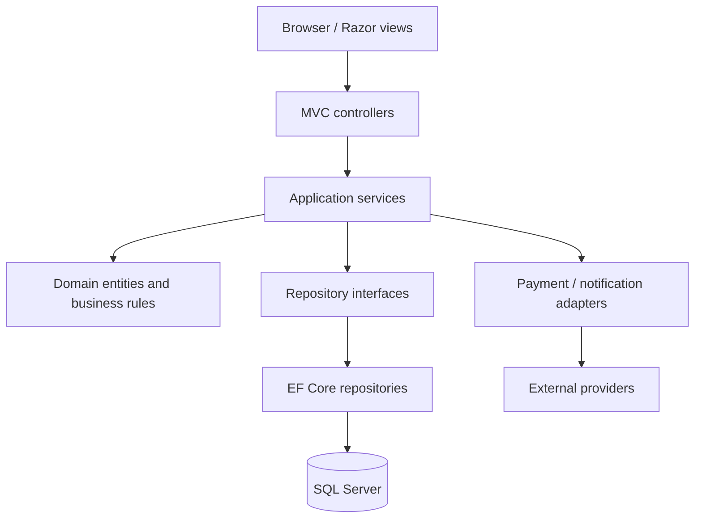

# Target architecture

## Scope

The `Banglore Ticket Management/BangloreTalkies` project is the migration
target. It is already an ASP.NET Core 8 MVC application, but currently uses
sample data and has no persistence boundary. The recommended first target is
one modular monolith, not microservices.

## Logical layers



### Proposed solution layout

```text
Banglore Ticket Management/
  BangloreTalkies.sln
  src/
    BangloreTalkies.Web/          # existing MVC host, controllers, views, wwwroot
    BangloreTalkies.Application/  # use cases, DTOs, validation, interfaces
    BangloreTalkies.Domain/       # entities, value objects, domain rules
    BangloreTalkies.Infrastructure/ # EF Core, migrations, repositories, providers
  tests/
    BangloreTalkies.UnitTests/
    BangloreTalkies.IntegrationTests/
  docs/
```

The existing project may remain a single project during the first migration
slice. The split should happen after the first vertical slice is covered by
tests, so project boundaries do not become a speculative rewrite.

## Core bounded areas

- Identity and access: registration, login, roles, password reset, profile.
- Catalog: movies, genres, cast, images, ratings and search.
- Scheduling: cinemas, showtimes, formats and seat inventory.
- Booking: seat hold, booking confirmation, booking history and cancellation.
- Payment: payment intent and provider result; never persist raw card data.
- Feedback and administration: feedback, movie administration, user reports.

Controllers should bind request models and return view models only. They should
not contain SQL, EF queries, password handling, payment logic, or seat
allocation rules. EF Core `DbContext` and repository implementations belong in
Infrastructure and are registered through dependency injection in the web host.

## Cross-cutting requirements

- Use `Microsoft.AspNetCore.Identity` or an equivalent well-tested password
  hashing and cookie-authentication implementation; do not carry forward the
  legacy reversible/opaque password contract without verification.
- Store connection strings and secrets in environment-specific configuration or
  a secret store, never in source control.
- Use structured logging, centralized exception handling, antiforgery
  protection, authorization policies, and server-side validation.
- Use UTC timestamps internally and make the business timezone explicit at the
  cinema/showtime boundary.
- Add optimistic/concurrency protection for seat inventory and a transaction
  around booking plus seat reservation.
