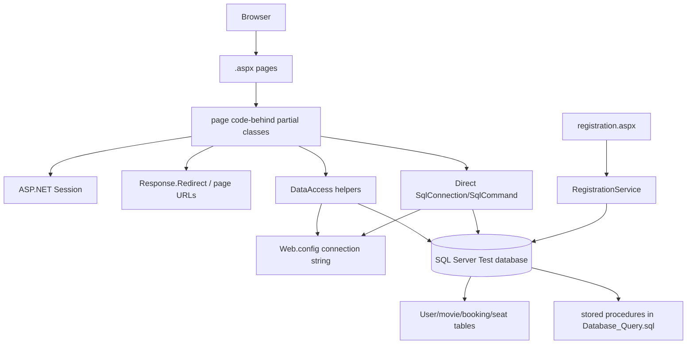
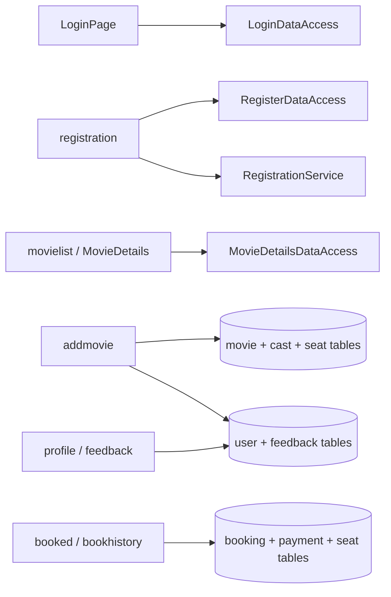

# Legacy dependency graph

The graph below separates confirmed compile/runtime relationships from
database relationships. Arrows point from caller to dependency.



## Page-to-capability dependencies



## Confirmed dependency details

- `LoginDataAccess`, `RegisterDataAccess`, and `MovieDetailsDataAccess` depend
  on SQL Server access and the configured connection string.
- `HomePage` depends on `MovieDetailsDataAccess.GetMovieDataList`; `LoginPage`
  depends on `LoginDataAccess.IsUserAuthencication`; registration depends on
  both `RegistrationService.UserNameExists` and
  `RegisterDataAccess.RegisterNewUserAccount`; `MovieDetails` depends on the
  movie and seat retrieval methods.
- `MovieTableInfos`, `MovieSeatStatus`, and `UserAccountInfos` are data-shape
  dependencies consumed by page/data-access flows.
- Most page classes depend on `System.Web.UI.Page`; generated designer files
  provide the controls consumed by their matching code-behind class.
- `RegistrationService` depends on `RegisterDataAccess.GetUserAccountDataList`
  and `JavaScriptSerializer`, and exposes a browser-called ASMX endpoint.
- `MovieDetails` depends on AES ID obfuscation, Session, ViewState, and 30
  per-seat event handlers; this is the primary booking-flow coupling to break.
- `addmovie` depends directly on SQL commands for movie uniqueness, image
  insertion, and seat/time initialization.
- `adminpage` depends on aggregate SQL queries over user, booking, movie, and
  card/payment tables for dashboard counts.
- `Global.asax` and `Web.config` are process-wide dependencies for startup,
  compilation, configuration, and runtime hosting.

## Migration interpretation

The first target dependency direction should be:

```text
Razor view -> MVC controller -> application service -> repository interface
-> EF Core repository -> DbContext -> SQL Server
```

No controller or view should depend on `DbContext` directly. No application
service should depend on Web Forms `Page`, `Session`, or physical `.aspx` URLs.
